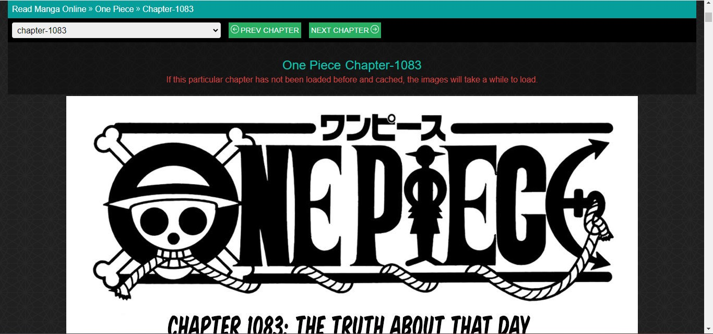
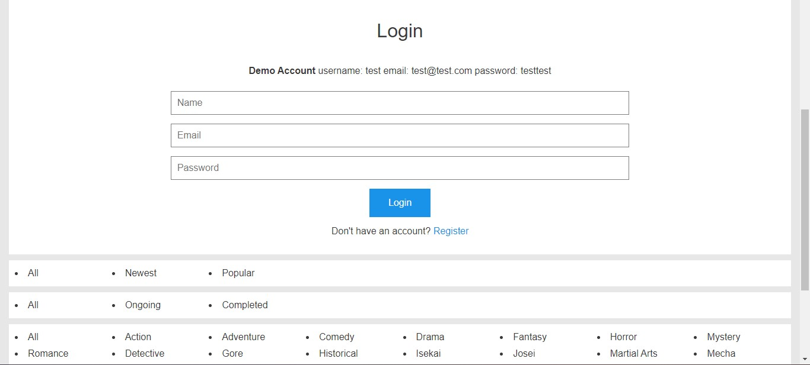
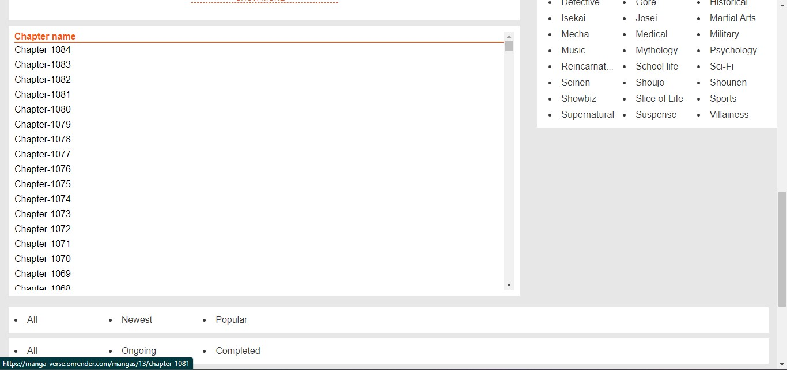
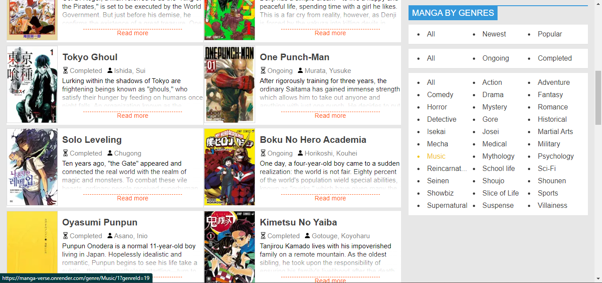
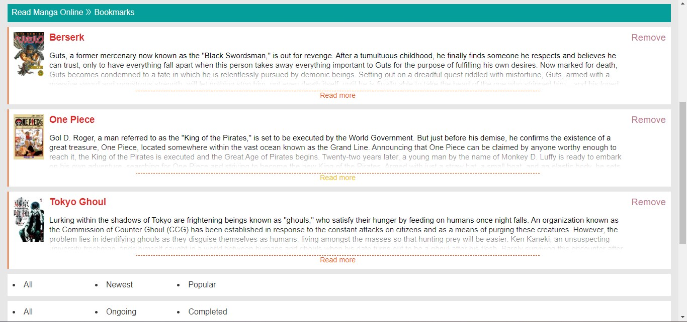
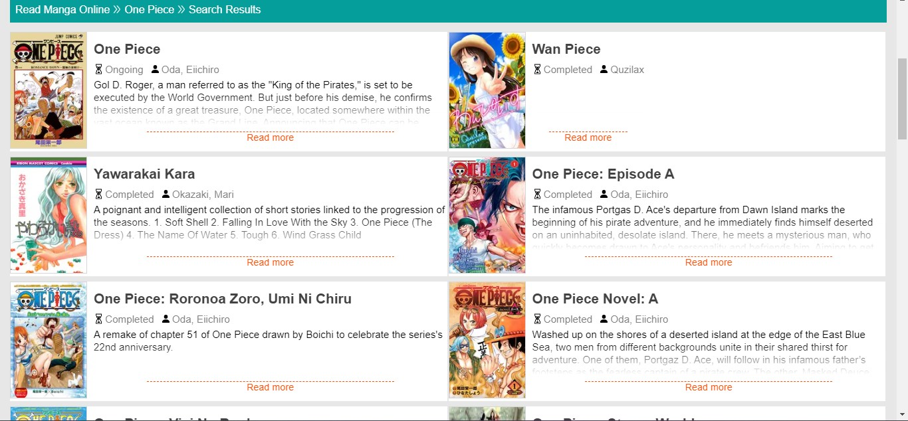

<a name="readme-top"></a>

<!-- [![Contributors][contributors-shield]][contributors-url]
[![Forks][forks-shield]][forks-url]
[![Stargazers][stars-shield]][stars-url]
[![Issues][issues-shield]][issues-url]
[![MIT License][license-shield]][license-url]
[![LinkedIn][linkedin-shield]][linkedin-url] -->

<!-- PROJECT LOGO -->
<br />
<div align="center">
  

  <h3 align="center">Manga Verse</h3>

  <p align="center">
    Welcome to Manga Verse, a manga viewing application.
    <br />
    <a href="https://github.com/Ree-m/manga-verse"><strong>Explore the docs »</strong></a>
    <br />
    <br />
    <a href="https://manga-verse.onrender.com">View Demo</a>
    ·
    <a href="https://github.com/Ree-m/manga-verse/issues">Report Bug</a>
    ·
    <a href="https://github.com/Ree-m/manga-verse/issues">Request Feature</a>
  </p>
</div>

<!-- TABLE OF CONTENTS -->
<details>
  <summary>Table of Contents</summary>
  <ol>
    <li>
      <a href="#about-the-project">About The Project</a>
      <ul>
        <li><a href="#built-with">Built With</a></li>
       li><a href="#features">Features</a></li>
      </ul>
    </li>
    <li>
      <a href="#getting-started">Getting Started</a>
      <ul>
        <li><a href="#prerequisites">Prerequisites</a></li>
        <li><a href="#installation">Installation</a></li>
      </ul>
    </li>
    <li><a href="#usage">Usage</a></li>
    <li><a href="#contributing">Contributing</a></li>
    <li><a href="#license">License</a></li>
    <li><a href="#contact">Contact</a></li>
    <li><a href="#acknowledgments">Acknowledgments</a></li>

  </ol>
</details>

<!-- ABOUT THE PROJECT -->

## About The Project

[![Manga Verse App][product-screenshot]](https://manga-verse-beta.vercel.app/)
Manga Vesre is a full-stack manga viewing app that combines the power of NEXTJS, JIKAN API, Pupeteer, Express, and MongoDB. It follows a microservices architecture and incorporates next auth for authentication. With its responsive design, Manga Vesre delivers an immersive manga reading experience across devices.

<p align="right">(<a href="#readme-top">back to top</a>)</p>

### Features

- Users can browse and view manga and its chapters.
- The app uses pupeteer to scrape manga chapters initially and then caches them for faster subsequent loads.
- All users can easily search for manga using the app's search function.
- Registered users can add manga to bookmark
- Filter manga by genre, status, and popularity according to your preferences.


### Optimizations

- Make filtering more dynamic
- Google auth
- Fix dupliacte bookmark bug
- Fix bookmark icon not showing number till i am on the bookmark page
- Access chapter everywhere in the app
- Change background to the bg-image
- Make carousel images less pixelated


### Built With

- [![Node][node.js]][node-url]
- [![React][react.js]][react-url]
- [![Next][next.js]][nextjs-url]
- [![Express][express.js]][express-url]
- [![MongoDB][mongodb]][mongodb-url]
- [![Puppeteer][puppeteer]][puppeteer-url]


<p align="right">(<a href="#readme-top">back to top</a>)</p>

## Live Demo

[Live Demo](https://manga-verse-beta.vercel.app/)

### Demo Account

username: test password: testtest email: test@test.com

<!-- GETTING STARTED -->

## Getting Started

To get a local copy up and running follow these simple example steps.

### Prerequisites

- npm
  ```sh
  npm install npm@latest -g
  ```
- node

### Setup

Add the .env.local file in root of the app

```sh
MONGODB_URI=
PRIVATE_KEY=
NODE_ENV=
ALLOWED_ORIGIN=
SCRAPER_API=
PORT=
NODE_VERSION=
```

Install the dependencies and devDependencies.

```sh

# In root of the app
npm install
cd scraper
npm install

```

To start the nextjs server 

```sh
# In root of the app
npm run dev
```

To start puppeteer server

```sh 
cd scraper
npm run start
```


<!-- USAGE EXAMPLES -->


## Usage

The app offers an immersive manga reading experience where users can seamlessly access and enjoy manga chapters. Dive into captivating storylines and stunning artwork as you effortlessly binge through your favorite manga series.
Clicking on a chapter in the manga details page displays the chapter\'s images. Users can easily navigate between chapters using "next chapter" and "previous chapter" buttons, or by selecting a specific chapter from the dropdown menu.



The app incorporates NextAuth to facilitate user authentication. This allows users to create accounts, log in, and securely access personalized feautures.


This page provides comprehensive information about a specific manga, including its title, author, genres, manga cover, and a list of chapters. Registered users can also bookmark manga directly from this page.




Users have the ability to filter manga based on various variables such as status (completed/ongoing), popularity, or genres.


Registered users can bookmark manga they enjoy, providing a convenient way to save and access their favorite titles. This feature enhances the user experience by allowing users to easily track and revisit their preferred manga.


Users can easily search for manga using the search bar located in the app's header.



<p align="right">(<a href="#readme-top">back to top</a>)</p>

<!-- CONTRIBUTING -->

## Contributing

Contributions are what make the open source community such an amazing place to learn, inspire, and create. Any contributions you make are **greatly appreciated**.

If you have a suggestion that would make this better, please fork the repo and create a pull request. You can also simply open an issue with the tag "enhancement".
Don't forget to give the project a star! Thanks again!

1. Fork the Project
2. Create your Feature Branch (`git checkout -b feature/AmazingFeature`)
3. Commit your Changes (`git commit -m 'Add some AmazingFeature'`)
4. Push to the Branch (`git push origin feature/AmazingFeature`)
5. Open a Pull Request

<p align="right">(<a href="#readme-top">back to top</a>)</p>

<!-- LICENSE -->

## License

Distributed under the MIT License. See `LICENSE.txt` for more information.

<p align="right">(<a href="#readme-top">back to top</a>)</p>

<!-- CONTACT -->

## Contact

Reem Bsrat - reembsrat@gmail.com

Project Link: [https://github.com/Ree-m/manga-verse](https://github.com/Ree-m/manga-verse)

<p align="right">(<a href="#readme-top">back to top</a>)</p>

<!-- ACKNOWLEDGMENTS -->

## Acknowledgments

- [Layout and Copy Inspiration](https://manganato.com/)
- [Scraping chapters](ww6.manganelo.tv)
- [Manga API](https://jikan.moe/)
- [Choose an Open Source License](https://choosealicense.com)
- [Img Shields](https://shields.io) 
- [React Icons](https://react-icons.github.io/react-icons/search)

<p align="right">(<a href="#readme-top">back to top</a>)</p>

[forks-shield]: https://img.shields.io/github/forks/othneildrew/Best-README-Template.svg?style=for-the-badge
[forks-url]: https://github.com/othneildrew/Best-README-Template/network/members
[stars-shield]: https://img.shields.io/github/stars/othneildrew/Best-README-Template.svg?style=for-the-badge
[stars-url]: https://github.com/othneildrew/Best-README-Template/stargazers
[issues-shield]: https://img.shields.io/github/issues/othneildrew/Best-README-Template.svg?style=for-the-badge
[issues-url]: https://github.com/othneildrew/Best-README-Template/issues
[license-shield]: https://img.shields.io/github/license/othneildrew/Best-README-Template.svg?style=for-the-badge
[license-url]: https://github.com/Ree-m/manga-verse/blob/main/LICENSE.txt
[product-screenshot]: app/styles/assests/readme/manga-verse-home-page.jpg
[node.js]: https://img.shields.io/badge/Node.js-43853D?style=for-the-badge&logo=node.js&logoColor=white
[node-url]: https://nodejs.org/en
[react.js]: https://img.shields.io/badge/React-20232A?style=for-the-badge&logo=react&logoColor=61DAFB
[react-url]: https://reactjs.org/
[next.js]:https://img.shields.io/badge/next.js-000000?style=for-the-badge&logo=nextdotjs&logoColor=white
[nextjs-url]: https://nextjs.org/
[mongodb]: https://img.shields.io/badge/MongoDB-4EA94B?style=for-the-badge&logo=mongodb&logoColor=white
[mongodb-url]: https://www.mongodb.com/docs/atlas/
[express.js]: https://img.shields.io/badge/Express.js-404D59?style=for-the-badge
[express-url]: https://expressjs.com/
[puppeteer]: https://img.shields.io/badge/-Puppeteer-40B5A4?logo=Puppeteer&logoColor=
[puppeteer-url]: https://pptr.dev/


